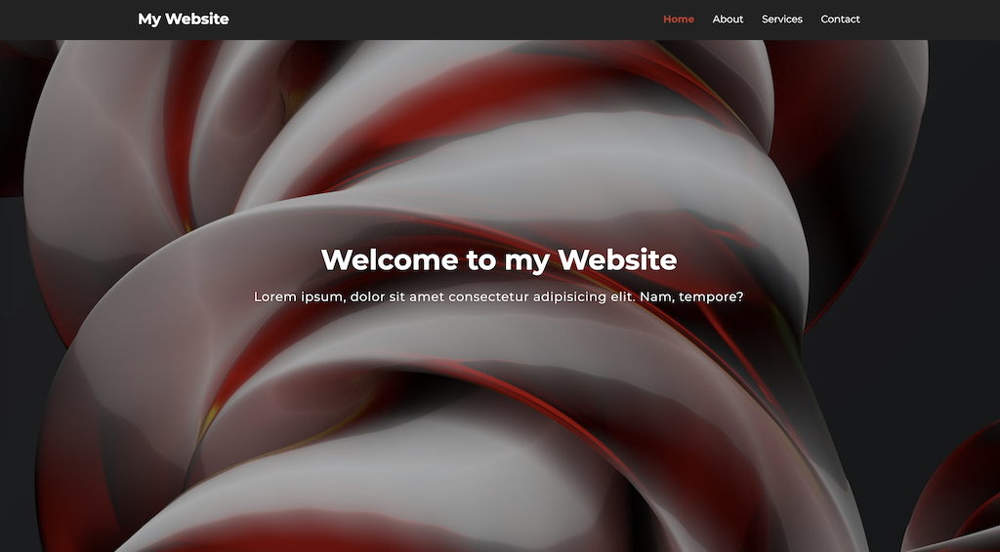
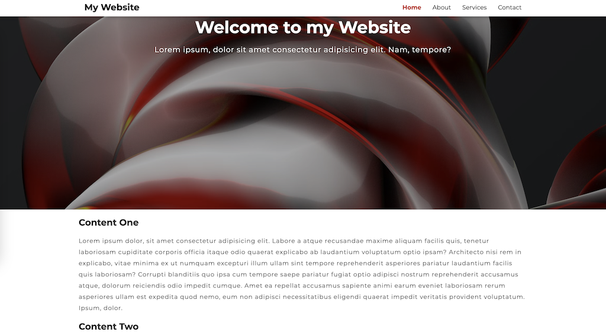

# Sticky Navigation Bar - a simple DOM manipulation exercise

This is a typical sticky navigation bar. It is a simple DOM manipulation exercise that I did, following along with a tutorial. 

### Links

- Solution URL: [click here](https://github.com/climaco-sarmiento/sticky-navbar)
- Live Site URL: [click here](https://climaco-sarmiento.github.io/sticky-navbar/)

### Screenshot

### Author

- Website - [Ubaid Khalid](https://www.ubaidkhalid.dev)
- LinkedIn - [Ubaid Khalid](https://www.linkedin.com/in/ubaid-khalid-dev/)
